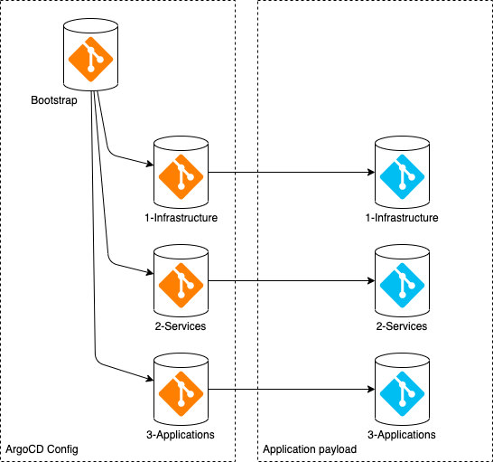

# GitOps repository

Repository that contains the yaml resources defining the desired state of the configuration for a cluster. The resources are organized to support deployments to multiple clusters.

## App of Apps

There are two major types of resources in the repository:

1. ArgoCD configuration
2. Application "payloads"

### ArgoCD configuration

In ArgoCD, collections of kubernetes resources that are deployed together are called "applications". Applications in ArgoCD are configured using a custom resource definition (CRD) in the cluster which means ArgoCD applications can deploy other ArgoCD applications (called the ["App of Apps pattern"](https://argoproj.github.io/argo-cd/operator-manual/cluster-bootstrapping/#app-of-apps-pattern)). With the "App of Apps pattern", the ArgoCD environment can be bootstrapped with an initial application. That initial bootstrap application can then be updated in the GitOps repository to configure other applications.

### Application "payloads"

The ArgoCD configuration points to other paths within the GitOps repository that contain the actual "payload" yaml to provision the applications (the deployments, config maps, etc that make up the applications)/

## Layered components

In addition to separating the ArgoCD configuration from the application "payloads", the configuration has also been divided into three different "layers" of the cluster configuration:

1. Infrastructure
2. Shared services
3. Applications

### Infrastructure

Foundational elements within the cluster, like namespaces, service accounts, role-based access control, etc. These resources are often managed by the infrastructure team and are required by the other resources.

### Shared Services

Shared services are application components that are used across multiple applications or across the cluster. Often these are operator-based services and managed independently from the applications.

### Applications

The application layer contains the applications deployed to the cluster, using the infrastructure and shared service components.

## Structure

Putting it all together, there are seven different locations for the GitOps content:

1. Bootstrap
2. Infrastructure ArgoCD configuration
3. Shared services ArgoCD configuration
4. Application ArgoCD configuration
5. Infrastructure payload
6. Shared services payload
7. Application payload



This repository implements a simple configuration where all seven collections of resources are stored in a single repository. For more complicated deployments, the resources can be separated into different repositories. For example, if the infrastructure, services, and application configuration is managed by different teams then each layer can be managed in a different gitops repository.

In order to understand where all the pieces that make up the GitOps deployment can be located, the bootstrap repository contains a yaml file that defined the repository and path for each of the seven locations. This file can be used both by humans to understand the layout and by the cli. An example of this file is provided below:

```yaml
bootstrap:
  argocd-config:
    project: 0-bootstrap
    repo: github.com/myorg/gitops-repo
    url: https://github.com/myorg/gitops-repo.git
    path: argocd/0-bootstrap
infrastructure:
  argocd-config:
    project: 1-infrastructure
    repo: github.com/myorg/gitops-repo
    url: https://github.com/myorg/gitops-repo.git
    path: argocd/1-infrastructure
  payload:
    repo: github.com/myorg/gitops-repo
    url: https://github.com/myorg/gitops-repo.git
    path: payload/1-infrastructure
services:
  argocd-config:
    project: 2-services
    repo: github.com/myorg/gitops-repo
    url: https://github.com/myorg/gitops-repo.git
    path: argocd/2-services
  payload:
    repo: github.com/myorg/gitops-repo
    url: https://github.com/myorg/gitops-repo.git
    path: payload/2-services
applications:
  argocd-config:
    project: 3-applications
    repo: github.com/myorg/gitops-repo
    url: https://github.com/myorg/gitops-repo.git
    path: argocd/3-applications
  payload:
    repo: github.com/myorg/gitops-repo
    url: https://github.com/myorg/gitops-repo.git
    path: payload/3-applications
```
